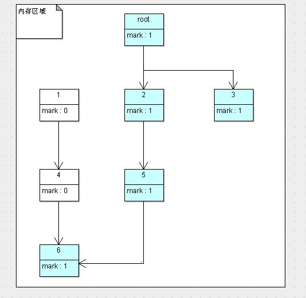
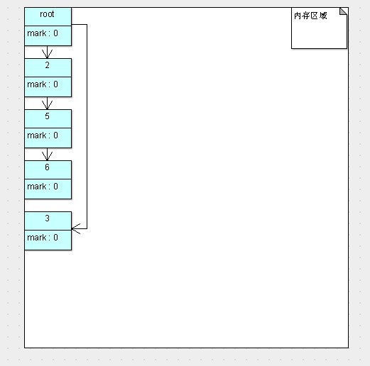
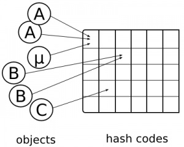
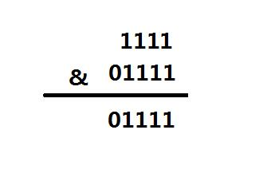
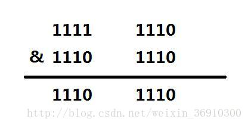

# JavaNote 


## Java类中变量和方法的加载顺序

### 变量

+ 成员变量
+ 静态变量

成员变量也叫做实例变量，定义在类中，存储在堆内存的对象中，在整个类中都可以访问。它随着类对象（实例）的创建而创建，随着类对象的回收而释放。

静态变量也叫做类变量，定义在类中，存储在方法区（共享数据区）的静态区，可以通过类名访问，也可以通过实例访问。静态变量随着类的加载而存在，随着类的消失而消失。

PS：局部变量定义方法中，存储在方法栈中，与方法共存亡。

### 加载顺序

#### 当调用类的静态成员时（只加载类，不实例化类）
jvm在初次加载类时会对类的静态代码块，静态变量，静态方法进行一次初始化。（按从上到下顺序，静态变量会初始化化，静态方法会被加载但不执行除非手动调用，静态代码块会执行）

```java
public class ClassLoadTest {
	public static void main(String[] args) {
		int j = TestA.j;
	}
}
class TestA{
	public static int i = staticMethod2();
	public static int j = 2;
	public TestA() {
		System.out.println("it's TestA's Constructor");
	}
	{
		System.out.println("it's TestA's NostaticBlock");
	}
	static {
		System.out.println("it's TestA's staticBlock");
	}
	public static int staticMethod1() {
		System.out.println("staticMethod1");
		return 1;
	}
	private static int staticMethod2() {
		System.out.println("staticMethod2");
		return 2;
	}
}
/**
* 输出
* staticMethod2
* it's TestA's staticBlock
*/
```


#### 当实例化类时

```java
public class ClassLoadTest {
	public static void main(String[] args) {
		TestA testA = new TestA();
	}
}
/**
* 输出
* 优先静态成员加载，然后是非静态块，然后构造函数
* staticMethod2
* it's TestA's staticBlock
* it's TestA's NostaticBlock
* it's TestA's Constructor
*/
```

#### 当调用子类的静态成员时

```java
public class ClassLoadTest {
	public static void main(String[] args) {
		int j = TestB.staticMethod1();
	}
}
class TestB extends TestA{
	public static int i = staticMethod2();
	public static int j = 2;
	public TestB() {
		System.out.println("it's TestB's Constructor");
	}
	{
		System.out.println("it's TestB's NostaticBlock");
	}
	static {
		System.out.println("it's TestB's staticBlock");
	}
	public static int staticMethod1() {
		System.out.println("TestB's staticMethod1");
		return 1;
	}
	private static int staticMethod2() {
		System.out.println("TestB's staticMethod2");
		return 2;
	}
/**
* 输出
* 优先父类静态成员初始化，然后子类静态成员初始化
* TestA's staticMethod2
* it's TestA's staticBlock
* TestB's staticMethod2
* it's TestB's staticBlock
* TestB's staticMethod1
*/
```

#### 当向上转型实例化父类时

```java
public class ClassLoadTest {
	public static void main(String[] args) {
		TestA testA = new TestB();
		System.out.println(testA.j);
		System.out.println(testA.k);
		testA.staticMethod1();
		testA.noStaticMethod();
	}
}
class TestA{
	public static int i = staticMethod2();
	public static int j = 1;
	public int k = 1;
    //...
    public int noStaticMethod() {
        System.out.println("TestA's NostaticMethod2");
        return 1;
	    }
    }

class TestB extends TestA{
    public static int i = staticMethod2();
    public static int j = 2;
    public int k = 2;
    //...
    public int noStaticMethod() {
        System.out.println("TestB's NostaticMethod2");
        return 2;
	    }
    }
/**
* 输出
* 优先父类静态成员初始化，然后子类静态成员初始化,然后父类非静态代码块，构造方法，然后子* 类非静态代码块，构造方法。成员变量，类变量，静态方法用的是父类的，非静态方法用的是子* 类的
* TestA's staticMethod2
* it's TestA's staticBlock
* TestB's staticMethod2
* it's TestB's staticBlock
* it's TestA's NostaticBlock
* it's TestA's Constructor
* it's TestB's NostaticBlock
* it's TestB's Constructor
* 1
* 1
* TestA's staticMethod1
* TestB's NostaticMethod2
*/
```

#### 有关内部类加载

加载一个类时，其内部类不会同时被加载。一个类被加载，当且仅当其某个静态成员（静态域、构造器、静态方法等）被调用时发生。 

```java
public class Outer {  
    static {  
        System.out.println("load outer class...");  
    }  
      
    //静态内部类  
    static class StaticInner {  
        static {  
            System.out.println("load static inner class...");  
        }  
          
        static void staticInnerMethod() {  
            System.out.println("static inner method...");  
        }  
    }  
          
    public static void main(String[] args) {  
        Outer outer = new Outer();      //此刻其内部类是否也会被加载？  
         System.out.println("===========分割线===========");  
        Outer.StaticInner.staticInnerMethod();      //调用内部类的静态方法  
    }  
}
/**
* load outer class... 
* ==========分割线========== 
* load static inner class... 
* static inner method... 
*/
```

根据内部类不会在其外部类被加载的同时被加载的事实，我们可以引申出单例模式的一种实现方式： 

```java
public class Singleton {  
    private Singleton() {}  
      
    static class SingletonHolder {  
        private static final Singleton instance = new Singleton();  
    }  
      
    public static Singleton getInstance() {  
        return SingletonHolder.instance;  
    }  
}  
```

这种单例实现方法不仅可以使类懒加载（延迟加载，即在使用时才加载），又能保证在多线程下的并发访问的正确性（因为是final修饰的，只会初始化一次）。

单例的另一种实现方式

```java

public static class SingletonOptimizeLazy {
　　　　static SingletonOptimizeLazy instance;
　　　　public static SingletonOptimizeLazy getInstance() {
　　　　　　if (instance == null) {
　　　　　　　　createInstance();
　　　　　　}
　　　　　　return instance;
　　　　}
　　　　private synchronized static SingletonOptimizeLazy createInstance() {
　　　　　　if (instance == null) {
　　　　　　　　instance = new SingletonOptimizeLazy();
　　　　　　}
　　　　　　return instance;
　　　　}
}
```

## JVM内存模型

[JVM内存模型](https://blog.csdn.net/javazejian/article/details/72772461 "")

[Java虚拟机栈](http://www.importnew.com/26842.html "")

[Java方法区](https://blog.csdn.net/u013241673/article/details/78574770 "")


## JVM方法内联优化

调用某个方法实际上是将程序执行转移到该方法所存放在内存中某个地址，当方法的程序内容执行完后，再返回到转去执行该方法前的地方。这种转移操作要求在转去前要保护现场并记忆执行的地址，转回后先要恢复现场，并按原来保存地址继续执行。也就是通常说的压栈和出栈。 因此，函数调用要有一定的时间和空间方面的开销。那么对于那些函数体代码不是很大，又频繁调用的函数来说，这个时间和空间的消耗会很大。

内联函数就是在程序编译时，编译器将程序中出现的内联函数的调用表达式用内联函数的函数体来直接进行替换。显然，这样就不会产生转去转回的问题，但是由于在编译时将函数体中的代码被替代到程序中，因此会增加目标程序代码量，进而增加空间开销，而在时间代销上不象函数调用时那么大，可见它是以目标代码的增加为代价来换取时间的节省。

如果JVM监测到一些小方法被频繁的执行，它会把方法的调用替换成方法体本身。比如说下面这个：
```java
private int add4(int x1, int x2, int x3, int x4) {  
        return add2(x1, x2) + add2(x3, x4);  
    }  

    private int add2(int x1, int x2) {  
        return x1 + x2;  
    } 
//执行一段时间后可能会替换成
private int add4(int x1, int x2, int x3, int x4) {  
        return x1 + x2 + x3 + x4;  
    } 
//这样就没有函数跳转的开销了
```

## JVM类的加载过程

[JVM类的加载过程](https://blog.csdn.net/zhangliangzi/article/details/51319033 "")

[JVM类的类加载器与双亲委派模型](https://blog.csdn.net/zhangliangzi/article/details/51338291 "")

[JVM类加载机制与Tomcat类加载器架构](https://blog.csdn.net/fuzhongmin05/article/details/57404890 "")

## Callable和Runnable接口

```java
public interface Callable<V> {
    V call() throws Exception;
}

public interface Runnable {
	public abstract run();
}
```

+ 相同点：

	两者都可用来编写多线程程序；
	两者都需要调用Thread.start()启动线程；
 

+ 不同点：

	两者最大的不同点是：实现Callable接口的任务线程能返回执行结果；而实现Runnable接口的任务线程不能返回结果；

	Callable接口的call()方法允许抛出异常；而Runnable接口的run()方法的异常只能在内部消化，不能继续上抛；

+ Callable接口支持返回执行结果，此时需要调用FutureTask.get()方法实现，此方法会阻塞主线程直到获取‘将来’结果；当不调用此方法时，主线程不会阻塞！

## 深入了解AtomicInteger

[深入了解AtomicInteger](https://www.cnblogs.com/rever/p/8215743.html "")


## JavaGC

[JavaGC](https://blog.csdn.net/zhangliangzi/article/details/52617145 "")

年轻代（Young Generation）：对象被创建时，内存的分配首先发生在年轻代（大对象可以直接 被创建在年老代），大部分的对象在创建后很快就不再使用，因此很快变得不可达，于是被年轻代的GC机制清理掉（IBM的研究表明，98%的对象都是很快消 亡的），这个GC机制被称为Minor GC或叫Young GC。注意，Minor GC并不代表年轻代内存不足，它事实上只表示在Eden区上的GC。

年轻代上的内存分配是这样的，年轻代可以分为3个区域：Eden区（伊甸园，亚当和夏娃偷吃禁果生娃娃的地方，用来表示内存首次分配的区域，再 贴切不过）和两个存活区（Survivor 0 、Survivor 1）

+ 绝大多数刚创建的对象会被分配在Eden区，其中的大多数对象很快就会消亡。Eden区是连续的内存空间，因此在其上分配内存极快；
  
+ 当Eden区满的时候，执行Minor GC，将消亡的对象清理掉，并将剩余的对象复制到一个存活区Survivor0（此时，Survivor1是空白的，两个Survivor总有一个是空白的）；

+ 此后，每次Eden区满了，就执行一次Minor GC，并将剩余的对象都添加到Survivor0；

+ 当Survivor0也满的时候，将其中仍然活着的对象直接复制到Survivor1，以后Eden区执行Minor GC后，就将剩余的对象添加Survivor1（此时，Survivor0是空白的）。

+ 当两个存活区切换了几次（HotSpot虚拟机默认15次，用-XX:MaxTenuringThreshold控制，大于该值进入老年代）之后，仍然存活的对象（其实只有一小部分，比如，我们自己定义的对象），将被复制到老年代。

Eden区是连续的空间，且Survivor总有一个为空。经过一次GC和复制，一个Survivor中保存着当前还活着的对象，而Eden区和另一个Survivor区的内容都不再需要了，可以直接清空，到下一次GC时，两个Survivor的角色再互换。因此，这种方 式分配内存和清理内存的效率都极高，这种垃圾回收的方式就是著名的**“停止-复制（Stop-and-copy）”清理法**

HotSpot虚拟机使用了两种技术来加快内存分配。分别是**bump-the-pointer**和**TLAB（Thread-Local Allocation Buffers）**，这两种技术的做法分别是：由于Eden区是连续的，因此bump-the-pointer技术的核心就是跟踪最后创建的一个对象，在对 象创建时，只需要检查最后一个对象后面是否有足够的内存即可，从而大大加快内存分配速度；而对于TLAB技术是对于多线程而言的，将Eden区分为若干 段，每个线程使用独立的一段，避免相互影响。TLAB结合bump-the-pointer技术，将保证每个线程都使用Eden区的一段，并快速的分配内存。

**年老代（Old Generation）**：年老代的空间一般比年轻代大，在年老代上发生的GC次数也比年轻代少。当年老代内存不足时， 将执行**Major GC**，也叫 **Full GC**。　　

年轻代：

　　由于绝大部分的对象都是短命的，甚至存活不到Survivor中，所以，Eden区与Survivor的比例较大，HotSpot默认是 8:1，即分别占新生代的80%，10%，10%。如果一次回收中，Survivor+Eden中**存活下来的内存超过了10%，则需要将一部分对象分配到老年代**。用-XX:SurvivorRatio参数来配置Eden区域Survivor区的容量比值，默认是8，代表Eden：Survivor1：Survivor2=8:1:1.

　　老年代：

　　老年代存储的对象比年轻代多得多，而且不乏大对象，对老年代进行内存清理时，如果使用停止-复制算法，则相当低效。一般，老年代用的算法是**标记-整理算法**，即：标记出仍然存活的对象（存在引用的），将所有存活的对象向一端移动，以保证内存的连续。在发生Minor GC时，虚拟机会检查每次晋升进入老年代的大小是否大于老年代的剩余空间大小，如果大于，则直接触发一次Full GC，否则，就查看是否设 置了-XX:+HandlePromotionFailure（允许担保失败），如果允许，则只会进行MinorGC，此时可以容忍内存分配失败；如果不允许，则仍然进行Full GC（这代表着如果设置-XX:+HandlePromotionFailure，则触发MinorGC就会同时触发Full GC，哪怕老年代还有很多内存，所以，最好不要这样做）。
　　方法区（永久代）：

　　永久代的回收有两种：常量池中的常量，无用的类信息，常量的回收很简单，没有引用了就可以被回收。对于无用的类进行回收，必须保证3点：

类的所有实例都已经被回收
加载类的ClassLoader已经被回收
类对象的Class对象没有被引用（即没有通过反射引用该类的地方）

GC判断是否回收对象是根据该对象有没被GC Roots引用（可达性分析）

在Java语言里，可作为GC Roots对象的包括如下几种： 


a.虚拟机栈(栈桢中的本地变量表)中的引用的对象 


b.方法区中的类静态变量引用的对象 


c.方法区中的常量引用的对象 


d.本地方法栈中JNI的引用的对象





## SoftReference & WeakReference

[SoftReference & WeakReference](https://www.cnblogs.com/dolphin0520/p/3784171.html "")


## Synthetic

[人工的，合成的 Synthetic关键字](https://blog.csdn.net/zhang_yanye/article/details/50301511 "")

Synthetic对应的值是4096（2^12）

```java
public boolean isSynthetic(int modifier) {
	return (modifier & 4096) != 0;
}
```
## Java反射

### Class.getxxx & Class.getDeclaredxxx区别

+ Class.getxxx返回某个类的**所有公用（public）**方法包括其继承类的公用方法，当然也包括它所实现接口的方法。

+ Class.getDeclaredxxx返回类或接口声明的所有方法，包括公共、保护、默认（包）访问和私有方法，**但不包括继承的方法**。当然也包括它所实现接口的方法。

setAccessible(boolean flag)方法来自AccessibleObject。Field、Constructor、Method都是它的子类。这个方法并不是标识域、方法能否访问的. public的方法 Accessible仍为false。而是启用或禁用安全检查 。使用了method.setAccessible(true)后 性能有了20倍的提升 

+ 由于成员内部类对象的创建依赖于外部类对象，持有指向外部类对象的引用。所以在反射构造成员内部类的时候一定要通过获取构造器再调用构造器的newInstance方法，其中必须要传入外部类的Class和实例。对于私有构造器，需要使用getDeclaredConstructor方法获取并使用setAccessible(true)来设置为可以获取的。
  
+ 静态内部类不持有外部类的引用，所以当其提供了无参显式的构造器的时候，可以直接在调用其class的newInstance()方法获得实例。如果构造器为private的则处理同1中。如果没有提供显式的的无参构造器，只提供了有参构造器，处理也同1中。

+ 如果内部类没有提供显式的构造器，则通过上面提到的方法构造内部类对象会抛出java.lang.IllegalAccessException错误。即要通过上面提到的方法使用反射机制创建内部类对象，内部类一定要提供显式的构造函数！


## Spring-boot Filter实践

[Spring-boot Filter实践](http://www.cnblogs.com/OnlyCT/p/9566180.html "")

## Spring-boot 配置文件详解

[Spring-boot 配置文件详解](http://www.cnblogs.com/itdragon/p/8686554.html "")

## @RequestParam & @PathVariable

@RequestParam和@PathVariable都能够完成类似的功能——因为本质上，它们都是用户的输入，只不过输入的部分不同，一个在URL路径部分，另一个在参数部分。要访问一篇博客文章，这两种URL设计都是可以的：

通过@PathVariable，例如/blogs/1

通过@RequestParam，例如blogs?blogId=1

那么究竟应该选择哪一种呢？建议：

+ 当URL指向的是某一具体业务资源（或者资源列表），例如博客，用户时，使用@PathVariable
+ 当URL需要对资源或者资源列表进行过滤，筛选时，用@RequestParam
例如我们会这样设计URL：

/blogs/{blogId}

/blogs?state=publish而不是/blogs/state/publish来表示处于发布状态的博客文章

但有的时候，参数确实不一定永远都存在，这是我们可以通过定义required属性：

@RequestParam(name="id",required=false,defaultValue="0")

## jpa Example

https://blog.csdn.net/long476964/article/details/79677526

## autowire警告

https://www.jianshu.com/p/36db3e167958

## SpringBoot开发详解（五）--Controller接收参数以及参数校验

https://blog.csdn.net/qq_31001665/article/details/71075743

## Java方法引用

https://www.cnblogs.com/JohnTsai/p/5806194.html
https://blog.csdn.net/weixin_41126303/article/details/81187002

其中reference to an instance method of an arbitrary object of a particular type（引用特定类型的任意对象的实例方法）的限制。
```java
//调用Person的test()方法的两种方法
Actor actor = Person::test;

//使用实例调用
Actor1 actor1 = new Person()::test;

interface Actor {
	void doSomething(Person person,Person p1, Doctor d2);
}

interface Actor1 {
	void doSomething(Person p1, Doctor d2);
}

class Person {
	public Person() {}

	public void test(Person p1, Person p2) {};
}

class Doctor extends Person {

}
```

+ 函数式接口方法的第一个参数，必须是被引用方法所在类或其子类的实例，其余参数类型必须和被引用方法参数列表里的参数的类型一样或其子类。（因为涉及到父类不能访问子类方法和向上转型问题）


## git workflow

+ git flow
+ github flow
+ gitlab flow

Merge: 加上 --no-ff使用策略模式合并分支，能清楚地看到提交历史

`git merge --no-ff -m "message" branchName`

### git flow

在采用 Git Flow 工作流的项目中，代码的中央仓库会一直存在以下两个长期分支：

master

develop

其中 origin/master 分支上的最新代码永远是版本发布状态。origin／develop 分支则是最新的开发进度。

当 develop 上的代码达到一个稳定的状态，可以发布版本的时候，develop上这些修改会以某种特别方式被合并到 master 分支上，然后标记上对应的版本标签。

协助分支：

除了主要分支，Git Flow 的开发模式还需要一系列的协助分支，来帮助更好的功能的并行开发，简化功能开发和问题修复。是的，就是下面的三类分支。这类分支是暂时分支非常无私奉献，在需要它们的时候，迫切地创建，用完它们的时候，又挥挥衣袖地彻底消失。 
协助分支分为以下几类：

Feature Branch

Release Branch

Hotfix Branch

Feature 分支用来做分模块功能开发，命名看开发者喜好，不要和其他类型的分支命名弄混淆就好，举个坏例子，命名为 master 就是一个非常不妥当的举动。模块完成之后，会合并到 develop 分支，然后删除自己。

Release 分支用来做版本发布的预发布分支，建议命名为 release-xxx。例如在软件 1.0.0 版本的功能全部开发完成，提交测试之后，从 develop 检出release-1.0.0 ,测试中出现的小问题，在 release 分支进行修改提交，测试完毕准备发布的时候，代码会合并到 master 和 develop，master 分支合并后会打上对应版本标签 v1.0.0, 合并后删除自己，这样做的好处是，在测试的时候，不影响下一个版本功能并行开发。

Hotfix 分支是用来做线上的紧急 bug 修复的分支,建议命名为 hotfix-xxx。当线上某个版本出现了问题，将检出对应版本的代码，创建 Hotfix 分支，问题修复后，合并回 master 和 develop ，然后删除自己。这里注意，合并到 master 的时候，也要打上修复后的版本标签。

### github flow

+ 只有一个长期分支 master ,而且 master 分支上的代码，永远是可发布状态,一般 master 会设置 protected 分支保护，只有有权限的人才能推送代码到 master 分支。
+ 如果有新功能开发，可以从 master 分支上检出新分支。
+ 在本地分支提交代码，并且保证按时向远程仓库推送。
+ 当你需要反馈或者帮助，或者你想合并分支时，可以发起一个 pull request。
+ 当 review 或者讨论通过后，代码会合并到目标分支。
一旦合并到 master 分支，应该立即发布。
+ issue tracking 问题追踪一般未解决的 issue 是 open 状态，已解决的会被标记为 closed。这就是 issue tracking。如果你是一个项目维护者，除了标记 issue 的开启和关闭，还可以给它标记上不同的标签，来优化项目。当提交的时候，如果提交信息中有 fix #1 等字段，可以自动关闭对应编号的 issue。

### gitlab flow

版本的延迟发布–Prodution Branch

master 分支不够，于是添加了一个 prodution 分支，专门用来发布版本。


不同环境的部署–Environment Branches & Upstream First

每个环境，都对应一个分支，例如服务端的测试环境，预发环境，正式环境，一个环境建一个分支。

这里要注意，代码合并的顺序，要按环境依次推送，确保代码被充分测试过,才会从上游分支合并到下游分支。除非是很紧急的情况，才允许跳过上游分支，直接合并到下游分支。这个被定义为一个规则，名字叫 “upstream first”，翻译过来是 “上游优先”。


版本发布分支–Release Branches & Upstream First

只有当对外发布软件的时候，才需要创建 release 分支。作为一个移动端开发来说，对外发布版本的记录是非常重要的，如果线上出现了一个问题，需要拿到问题出现对应版本的代码，才能准确定位问题。

在 Git Flow ,版本记录是通过 master 上的 tag 来记录。发现问题，创建 hotfix 分支，完成之后合并到 master 和 develop。

在 GitLab Flow ，建议的做法是每一个稳定版本，都要从master分支拉出一个分支，比如2-3-stable、2-4-stable等等。发现问题，就从对应版本分支创建修复分支，完成之后，先合并到 master，才能再合并到 release 分支，遵循 “上游优先” 原则。


### Git Flow & GitHub Flow 的瑕疵

当 Git Flow 出现后，它解决了之前项目管理的很让人头疼的分支管理，但是实际使用过程中，也暴露了很多问题： 
- 默认工作分支是 develop，但是大部分版本管理工具默认分支都是 master，开始的时候总是需要切换很麻烦。 
- Hotfix 和 Release 分支在需要版本快速迭代的项目中，几乎用不到，因为刚开发完就直接合并到 master 发版，出现问题 develop 就直接修复发布下个版本了。 
- Hotfix 和 Release 分支，一个从 master 创建，一个从 develop 创建，使用完毕，需要合并回 develop 和 master。而且在实际项目管理中，很多开发者会忘记合并回 develop 或者 master。

GitHub Flow 的出现，非常大程度上简化了 Git Flow ，因为只有一个长期分支 master，并且提供 GUI 操作工具，一定程度上避免了上述的几个问题，然而在一些实际问题面前，仅仅使用 master 分支显然有点力不从心，例如： 
- 版本的延迟发布（例如 iOS 应用审核到通过中间，可能也要在 master 上推送代码） 
- 不同环境的部署 （例如：测试环境，预发环境，正式环境） 
- 不同版本发布与修复 （是的，只有一个 master 分支真的不够用）


## Vim Operation

ci'、ci"、ci(、ci[、ci{、ci< - 分别更改这些配对标点符号中的文本内容

di'、di"、di(或dib、di[、di{或diB、di< - 分别删除这些配对标点符号中的文本内容

yi'、yi"、yi(、yi[、yi{、yi< - 分别复制这些配对标点符号中的文本内容

vi'、vi"、vi(、vi[、vi{、vi< - 分别选中这些配对标点符号中的文本内容

## Class.forname()和ClassLoader.loadClass()

https://blog.csdn.net/simple_chao/article/details/55098596

调用Class.forName(String className)(ps:只有一个参数的方法时)，默认是调用forName(String name, boolean initialize, ClassLoader loader, Class<?> caller)，第二个参数为true；则表示加载类并运行静态代码块（完成加载，链接，初始化操作，静态代码块在初始化时执行），而用ClassLoader.loadClass()来加载类，则只会完成加载和链接操作。

## Class类型信息
当程序创建第一个对类的**静态成员引用**时，就会加载这个被使用的类(实际上加载的就是这个类的字节码文件)，注意，使用new操作符创建类的新实例对象也会被当作对类的静态成员的引用(构造函数也是类的静态方法)

调用一个类的static final的常量并不会触发这个类的初始化（也不会执行静态块），因为常量是在编译期（链接）就确定的量了。而调用一个类的static静态变量就会触发这个类的初始化，因为链接是为静态常量分配内存空间和类型初始值。

```java
class Initable {
  //编译期静态常量
  static final int staticFinal = 47;
  //非编期静态常量,这个要运行时才能确定值
  static final int staticFinal2 =
    ClassInitialization.rand.nextInt(1000);
  static {
    System.out.println("Initializing Initable");
  }
}

```

## 静态类

https://www.cnblogs.com/Alex--Yang/p/3386863.html


## ThreadLocal


https://www.cnblogs.com/dreamroute/p/5034726.html


ThreadLocalMap不是Map借口的实现，它没有实现任何接口也没有继承任何类，它内部的数据结构实际上只是一个数组：Entry[] table，只不过用来HASH算法来做散列。

当threadLocal实例可以被GC回收时，系统可以检测到该threadLocal对应的Entry是否已经过期（根据reference.get() == null来判断，如果为true则表示过期，程序内部称为stale slots）来自动做一些清除工作，否则如果不清除的话容易产生内存无法释放的问题：value对应的对象即使不再使用，但由于被threadLocalMap所引用导致无法被GC回收。实际代码中，ThreadLocalMap会在set，get以及resize等方法中对stale slots做自动删除（set以及get不保证所有过期slots会在操作中会被删除，而resize则会删除threadLocalMap中所有的过期slots）。当然将threadLocal对象设置为null并不能完全避免内存泄露对象，最安全的办法仍然是调用ThreadLocal的remove方法，来彻底避免可能的内存泄露。

## HashCode

+ 相等的对象必须要有相同的哈希码
+ 不相等的对象不一定有着不同的哈希码！
+ 有同一个哈希值的对象不一定相等！
  


hashmap通过key的hash值来决定存储位置，在get()时，先通过key的hash值定位在哪个桶中，然后再从第一个对象开始判断，key是否相等或equals()。不同就下一个。（有同一个哈希值的对象不一定相等）

## 反射优化

反射一般指的是反射包中的Constructor, Method, Field, 使用Class.forName()或Classloader来加载类。

但是反射相比于直接调用，要花更多的时间来查找方法等，所以效率较低。常用的优化方式有：

1. 使用HashMap缓存方法，https://www.cnblogs.com/RUN-TIME/p/5780447.html
2. 使用ReflectASM高性能反射包 https://www.cnblogs.com/juetoushan/p/7724793.html （使用索引反射会好些）在调用方法之前使用了反射、又生成了字节码还进行了新类的加载 这三部一样是很耗时的。如果将从开始到结束的所有时间算进去 其实它相比其他反射并不怎么占优，但如果只生成一次代理类的话其性能就很高了。所以使用这个jar包要注意缓存生成的class对象。尽量少重复生成。

## 线程池种类和使用场景
https://www.cnblogs.com/sachen/p/7401959.html

## hashmap长度总是2的幂次方原因

HashMap通过哈希算法得出哈希值之后，决定将键值对放入哪个索引的方法
```java
static int indexFor(int h, int length) {
 
// assert Integer.bitCount(length) == 1 : "length must be a non-zero power of 2";
 
return h & (length-1);
 
}
```

假如hashmap的容量为16，则length - 1 的二进制为1111
若hash为15（1111）则


假如容量为15，则length - 1 的二进制为1110，则hash为14（1110）与15（1111）运算后得到的是同一个位置


+ 增加了碰撞的几率（容易得到相同的位置）
+ 减慢了查询的效率（得到相同位置后，生成链表，查找时要遍历链表）
+ 造成空间的浪费（对于length - 1 = 14(1110)来说，0001，0011，0101，1001，1011，0111，1101这几个位置永远都不能存放元素了）

## synchronized和ReentrantLock的区别

https://www.cnblogs.com/fanguangdexiaoyuer/p/5313653.html

为什么说synchronized的等待队列是无法中断的呢？这是因为在线程外（也就是在其他线程，比如主线程）调用Thread.interrupt()方法只是给这个线程赋予了一个中断状态，而不会直接中断该线程。所以线程在synchronized的等待队列中时，外部没法中断该线程(在同步方法中调用wait(),sleep()方法，然后在外面调用interrupt()方法不算在队列中 中断，因为已经从队列进入同步方法了)。而ReentrantLock有个lockInterruptibly()方法，他内部有这个一段代码        
```java
if (Thread.interrupted())
    throw new InterruptedException();
```
也就是线程在尝试获取锁的时候，如果该线程已经有中断状态（外部调用了Thread.interrupt()），则抛出异常，若没有，这为这个线程添加一个中断状态（具体原因见）。线程有了中断状态，外部就可以调用interrupt()方法来中断它。

Synchronized和ReentrantLock他们的开销差距是在释放锁时唤醒线程的数量,Synchronized是唤醒锁池里所有的线程+刚好来访问的线程,而ReentrantLock则是当前线程后进来的第一个线程+刚好来访问的线程。

如果是线程并发量不大的情况下,那么Synchronized因为自旋锁,偏向锁,轻量级锁的原因,不用将等待线程挂起,偏向锁甚至不用自旋,所以在这种情况下要比ReentrantLock高效。

## Java线程并发中常见的锁--自旋锁 偏向锁

 如果偏向锁失败，Java虚拟机会让线程申请轻量级锁。轻量级锁在虚拟机内部，使用一个称为BasicObjecLock的对象实现，这个对象内部由一个BasicLock对象和一个持有该锁的Java对象指针组成。BasicobjectLock对象放置在Java栈的栈帧中。

首先，BasicLock通过set_displaced_header()方法备份了原对象的Mark Word。接着，使用CAS操作，尝试将BasicLock的地址复制到对象头的Mark Word。如果复制 成功，那么加锁成功。如果加锁失败，那么轻量级锁就有可能被膨胀为重量级锁。由于BasicObjectLock对象在线程栈中，因此该指针必然指向持有该锁的线程栈空间。当需要判断一个线程是否持有该对象时，只需要简单地判断对象头的指针是否在当前线程的栈地址范围即可。

https://www.cnblogs.com/softidea/p/5530761.html

## 自定义异常配合枚举

在系统开发过程中，总少不免要自己处理一些异常信息，然后将异常信息变成友好的提示返回到客户端的这样一个过程，之前都是new一个自定义的异常，当然这个所谓的自定义异常也是继承RuntimeException的，但这样往往会造成异常信息说明不一致的情况，所以就想到了用枚举来解决的办法。

```java
public interface IErrorCode {
     
    public String getErrorCode();
     
    public String getErrorMessage();
     
}

public enum SysErrorEnums implements IErrorCode {

    /**参数为空*/
    EMPTY_PARAME("A11002","参数为空"),
    /**参数错误*/
    ERROR_PARAME("A11002","参数错误");
    
    private String errorCode;
    private String errorMessage;
    
    private SysErrorEnums(String errorCode, String errorMessage) {
        this.errorCode = errorCode;
        this.errorMessage = errorMessage;
    }

    public String getErrorCode() {
        return errorCode;
    }

    public void setErrorCode(String errorCode) {
        this.errorCode = errorCode;
    }

    public String getErrorMessage() {
        return errorMessage;
    }

    public void setErrorMessage(String errorMessage) {
        this.errorMessage = errorMessage;
    }
}

public class BusinessException extends RuntimeException {
    
    private static final long serialVersionUID = 1L;
    
    private IErrorCode iErrorCode;
    
    private String errorCode;
    private String errorMessage;
    private Map<String, Object> errorData;
        
        public BusinessException(IErrorCode iErrorCode) {
        super();
        this.iErrorCode = iErrorCode;
        this.errorCode = iErrorCode.getErrorCode();
        this.errorMessage = iErrorCode.getErrorMessage();
    }
        
        //其他get、set、构造方法
}

if(true){
   throw new BusinessException(SysErrorEnums.EMPTY_OBJ);
}
```

## Mysql索引失效

https://www.cnblogs.com/shynshyn/p/7887742.html
https://blog.csdn.net/wdjxxl/article/details/79790421

+ 查询条件中有or
+ like的模糊查询以%开头，索引失效
+ 如果列类型是字符串，那一定要在条件中将数据使用引号引用起来，否则不会使用索引
+ 如果MySQL预计使用全表扫描要比使用索引快，则不使用索引
+ 联合索引的最左原则，如（c1,c2,c3）的联合索引，where 条件按照索引建立的字段顺序来使用（不代表and条件必须按照顺序来写），如果中间某列没有条件，则不使用索引。（只能使用c1  c1,c2 c1,c2,c3这三种组合来查询，如果条件where c1 = 1 and c3 = 2则只使用c1的索引  PS：一个索引长度为3byte）

## jvm 内存模型

+ 栈（stack 虚拟机栈 本地方法栈 程序计数器）
+ 堆（heap）
+ 方法区

(Code Segment-代码段 Data Segment-数据段都是属于方法区)比如最通用的tomcat启动一个war包服务，tomcat的类加载器将war中的class字节码加载到jvm的方法区（习惯称之为永久代），存储字节码的的位置被称为Code Segment ，存储静态常量和字符串常量的位置被称为Data Segment。 

## java 1.5 逆变与协变

如果A、B表示类型，f(⋅)表示类型转换，≤表示继承关系（比如，A ≤ B表示A是由B派生出来的子类）；

+ f(⋅)是逆变（contravariant）的，当A ≤ B时有f(B)≤f(A)成立；
+ f(⋅)是协变（covariant）的，当A ≤ B时有f(A)≤f(B)成立；
+ f(⋅)是不变（invariant）的，当A ≤ B时上述两个式子均不成立，即f(A)与f(B)相互之间没有继承关系。

List<? extends Number> list = new ArrayList<Integer>();
ArrayList<Integer>是List<? extends Number>派生出来的子类，而Integer也是Number派生出来的子类，所以时协变，以此类推，List<? super Number> list = new ArrayList<Object>();ArrayList<Object>是List<? extends Number>派生出来的子类，而Number是Object派生出来的子类，所以是逆变

PECS总结：
要从泛型类取数据时，用extends；  协变
要往泛型类写数据时，用super；    逆变
既要取又要写，就不用通配符（即extends与super都不用） 不变

从Java 1.5开始，子类覆盖父类方法时允许协变返回更为具体的类型：

```java
class Super {
    Number method(Number n) { ... }
}

class Sub extends Super {
    @Override 
    Integer method(Number n) { ... }
}
```


https://www.cnblogs.com/softidea/p/5122304.html
https://www.jianshu.com/p/2bf15c5265c5


## Mysql事务隔离级别

在Mysql InnoDB 中，事务主要有四种隔离级别

+ Read uncommitted (未提交读)
+ Read committed (已提交读)
+ Repeatable read (可重复读) mysql默认
+ Serializable (可串行化)

在理解四种隔离级别之前，我们需要先了解另外三个名词：

+ 脏读

    另一个事务修改了数据，但尚未提交，而本事务中的SELECT会读到这些未被提交的数据。
+ 不可重复读

    解决了脏读后，会遇到，同一个事务执行过程中，另外一个事务提交了新数据，因此本事务先后两次读到的数据结果会不一致。（主要出现在delete和update中）
+ 幻读

    解决了不重复读，保证了同一个事务里，查询的结果都是事务开始时的状态（一致性）。但是，如果另一个事务同时提交了新数据，本事务再更新时，就会“惊奇的”发现了这些新数据，貌似之前读到的数据是“鬼影”一样的幻觉。(insert)

    已提交读解决脏读，可重复读解决不可重复读和幻读问题

    https://blog.csdn.net/u014377963/article/details/71374590

## synchronized和ReentrantLock的区别

https://www.cnblogs.com/fanguangdexiaoyuer/p/5313653.html

https://www.cnblogs.com/-new/p/7256297.html

## Java多线程之interrupt()的深度研究

interrupt status(中断状态)：请记住这个术语，中断机制就是围绕着这个字段来工作的。在Java源码中代表中断状态的字段是：private volatile Interruptible blocker;

https://www.cnblogs.com/carmanloneliness/p/3516405.html

## 为什么volatile关键字保证不了线程安全

https://blog.csdn.net/qq_33330687/article/details/80990729

## LongAdder源码学习

LongAdder在AtomicLong的基础上将单点的更新压力分散到各个节点，在低并发的时候通过对base的直接更新可以很好的保障和AtomicLong的性能基本保持一致，而在高并发的时候通过分散提高了性能。 

```java
@sun.misc.Contended static final class Cell {
    volatile long value;
    Cell(long x) { value = x; }
    final boolean cas(long cmp, long val) {
        return UNSAFE.compareAndSwapLong(this, valueOffset, cmp, val);
    }

    // Unsafe mechanics
    private static final sun.misc.Unsafe UNSAFE;
    private static final long valueOffset;
    static {
        try {
            UNSAFE = sun.misc.Unsafe.getUnsafe();
            Class<?> ak = Cell.class;
            valueOffset = UNSAFE.objectFieldOffset
                (ak.getDeclaredField("value"));
        } catch (Exception e) {
            throw new Error(e);
        }
    }
}

public void add(long x) {
        Cell[] as; long b, v; int m; Cell a;
        //尝试更新base,若并发不高，能更新成功，退出条件(cas更新)
        if ((as = cells) != null || !casBase(b = base, b + x)) {
            boolean uncontended = true;
            /**
            * 尝试第二次更新值,取得Cell[]中的一个值，getProbe() & m是
            * 取得一个随机整数然后和m(数组大小-1)做与运算，得出的值在
            * 0～(as.length - 1)之间,更新成功则退出条件
            */
            if (as == null || (m = as.length - 1) < 0 ||
                (a = as[getProbe() & m]) == null ||
                !(uncontended = a.cas(v = a.value, v + x)))
                longAccumulate(x, null, uncontended);
        }
    }

final void longAccumulate(long x, LongBinaryOperator fn,
                              boolean wasUncontended) {
        int h;
        // 线程安全取得一个随机整数，设置是否并发竞争为true
        if ((h = getProbe()) == 0) {
            ThreadLocalRandom.current(); 
            h = getProbe();
            wasUncontended = true;
        }
        //是否碰撞，参考hashmap
        boolean collide = false; 
        for (;;) {
            Cell[] as; Cell a; int n; long v;
            if ((as = cells) != null && (n = as.length) > 0) {
                //如果数组指定位置为空，则赋值
                if ((a = as[(n - 1) & h]) == null) {
                    if (cellsBusy == 0) {       
                        Cell r = new Cell(x);
                        //创建Cell时,casCellsBusy()锁住数组
                        if (cellsBusy == 0 && casCellsBusy()) {
                            boolean created = false;
                            try {               
                                Cell[] rs; int m, j;
                                if ((rs = cells) != null &&
                                    (m = rs.length) > 0 &&
                                    rs[j = (m - 1) & h] == null) {
                                    rs[j] = r;
                                    created = true;
                                }
                            } finally {
                                cellsBusy = 0;
                            }
                            if (created)
                                break;
                            continue;
                        }
                    }
                    //指定数组位置为null则说明没有碰撞
                    collide = false;
                }
                else if (!wasUncontended)
                    wasUncontended = true;
                /**
                * a不为null,更新a的value,成功则退出。更新失败则
                * 说明多个线程同时更新一个Cell，并发量大，碰撞几率高
                * 可能需要扩容
                */
                else if (a.cas(v = a.value, ((fn == null) ? v + x :
                                             fn.applyAsLong(v, x))))
                    break;
                /**
                * 若数组大小大于CPU个数，则说明碰撞不是由于数组过小导致
                * 则重新尝试更新数据
                */
                else if (n >= NCPU || cells != as)
                    collide = false;            
                else if (!collide)
                    collide = true;
                //扩容数组,扩容时锁住数组
                else if (cellsBusy == 0 && casCellsBusy()) {
                    try {
                        if (cells == as) {      
                            Cell[] rs = new Cell[n << 1];
                            for (int i = 0; i < n; ++i)
                                rs[i] = as[i];
                            cells = rs;
                        }
                    } finally {
                        cellsBusy = 0;
                    }
                    collide = false;
                    continue;                   
                }
                h = advanceProbe(h);
            }
            //若cell[]为空，初始化
            else if (cellsBusy == 0 && cells == as && casCellsBusy()) {
                boolean init = false;
                try {                           // Initialize table
                    if (cells == as) {
                        Cell[] rs = new Cell[2];
                        rs[h & 1] = new Cell(x);
                        cells = rs;
                        init = true;
                    }
                } finally {
                    cellsBusy = 0;
                }
                if (init)
                    break;
            }
            else if (casBase(v = base, ((fn == null) ? v + x :
                                        fn.applyAsLong(v, x))))
                break;                          // Fall back on using base
        }
    }
//加锁方法
final boolean casCellsBusy() {
    return UNSAFE.compareAndSwapInt(this, CELLSBUSY, 0, 1);
}

/**
* 返回各个线程操作总和，LongAdder在统计的时候如果有并发更新
* 可能导致统计的数据有误差，因为volatile并不能保证并发安全
*/
public long sum() {
    Cell[] as = cells; Cell a;
    long sum = base;
    if (as != null) {
        for (int i = 0; i < as.length; ++i) {
            if ((a = as[i]) != null)
                sum += a.value;
        }
    }
    return sum;
}
```

## 深克隆与浅克隆

https://www.cnblogs.com/c-h-y/p/9574586.html

对象要实现Cloneable接口才能调用clone()方法，否则会抛出CloneNotSupportException。clone()方法需要重写，或者使用序列化的方式来深克隆对象

## sleep()和wait()的区别

+ 从使用角度看，sleep是Thread线程类的方法，而wait是Object顶级类的方法。
+ sleep可以在任何地方使用，而wait只能在同步方法或者同步块中使用。
+ sleep,wait调用后都会暂停当前线程并让出cpu的执行时间，但不同的是sleep不会释放当前持有的对象的锁资源，到时间后会继续执行，而wait会放弃所有锁并需要notify/notifyAll后重新获取到对象锁资源后才能继续执行。


## String为什么时final类
+ 为了实现字符串池
+ 为了线程安全
+ 为了实现String可以创建HashCode不可变性
那么为什么保证String不可变呢,因为只有当字符串是不可变的，字符串池才有可能实现。字符串池的实现可以在运行时节约很多heap空间，因为不同的字符串变量都指向池中的同一个字符串。但如果字符串是可变的，那么String interning将不能实现，因为这样的话，如果变量改变了它的值，那么其它指向这个值的变量的值也会一起改变。

## HashMap与TreeMap的区别

+ HashMap通过hashcode对其内容进行快速查找，而 TreeMap中所有的元素都保持着某种固定的顺序，如果你需要得到一个有序的结果你就应该使用TreeMap（HashMap中元素的排列顺序是不固定的）
+ HashMap继承AbstractMap覆盖了equals()和hashCode()方法以确保两个相等映射返回相同的哈希码,TreeMap继承自SortedMap它用来保持键的有序顺序(HashMap的键对象需要覆写equals()和hashCode()方法)

## TCP三次握手，4次挥手
https://www.cnblogs.com/lms0755/p/9053119.html
https://blog.csdn.net/u012371712/article/details/80795297
https://juejin.im/entry/5981c5df518825359a2b9476

TCP/IP的模型将协议分成五个层次，它们分别是物理层、链路层、网络层、传输层和应用层

+ SYN：发起一个新连接
+ ACK：确认序号有效
+ FIN：释放一个连接

established状态

### 为什么要三次握手？

为了防止已失效的连接请求报文段突然又传送到了服务端，因而产生错误

client发出的第一个连接请求报文段并没有丢失，而是在某个网络结点长时间的滞留了，以致延误到连接释放以后的某个时间才到达server。本来这是一个早已超时失效的报文段。但server收到此失效的连接请求报文段后，就误认为是client再次发出的一个新的连接请求。于是就向client发出确认报文段，同意建立连接。假设不采用“三次握手”，那么只要server发出确认，新的连接就建立了。由于现在client并没有发出建立连接的请求，因此不会理睬server的确认，也不会向server发送数据。但server却以为新的运输连接已经建立，并一直等待client发来数据。这样，server的很多资源就白白浪费掉了。采用“三次握手”的办法可以防止上述现象发生。

### 为什么要四次分手？

TCP协议是一种面向连接的、可靠的、基于字节流的运输层通信协议。TCP是全双工模式，这就意味着，当主机1发出FIN报文段时，只是表示主机1已经没有数据要发送了，主机1告诉主机2，它的数据已经全部发送完毕了；但是，这个时候主机1还是可以接受来自主机2的数据；当主机2返回ACK报文段时，表示它已经知道主机1没有数据发送了，但是主机2还是可以发送数据到主机1的；当主机2也发送了FIN报文段时，这个时候就表示主机2也没有数据要发送了，就会告诉主机1，我也没有数据要发送了，之后彼此就会愉快的中断这次TCP连接。